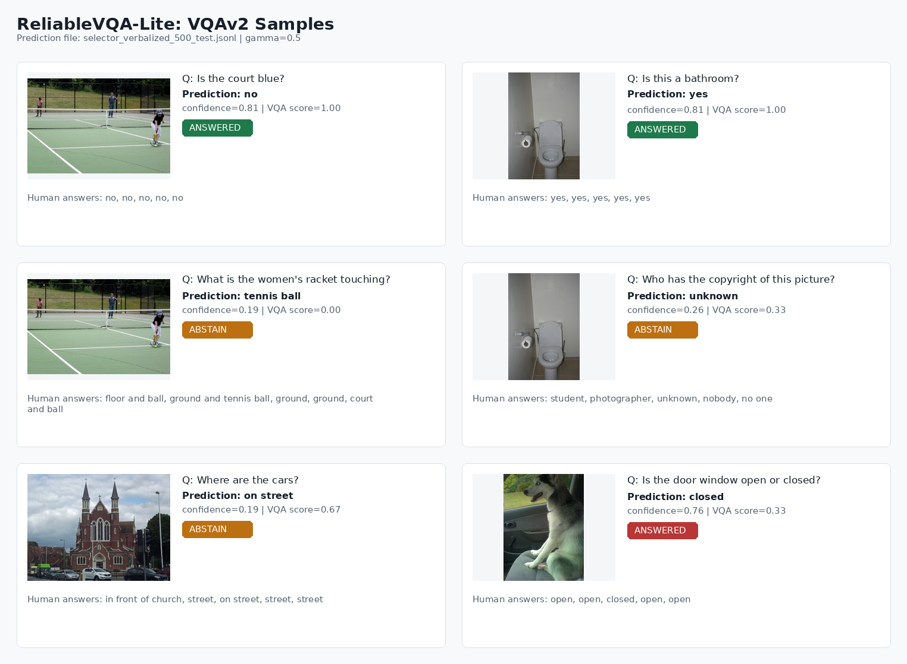
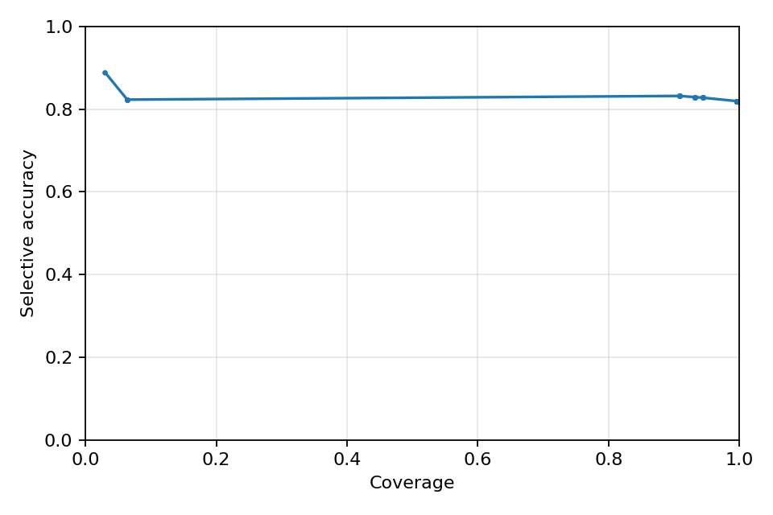
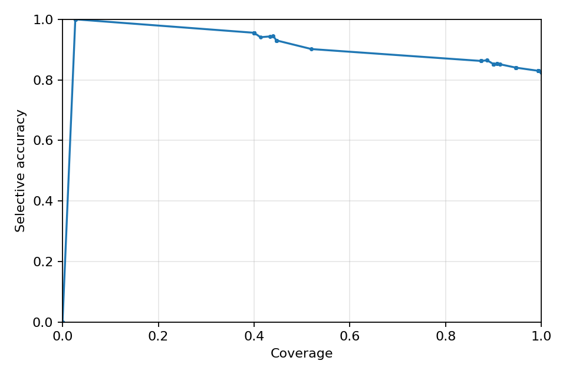
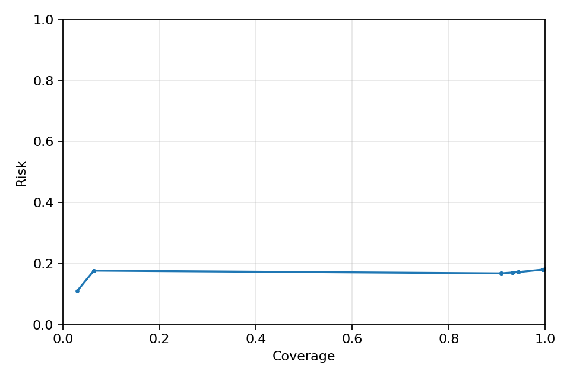
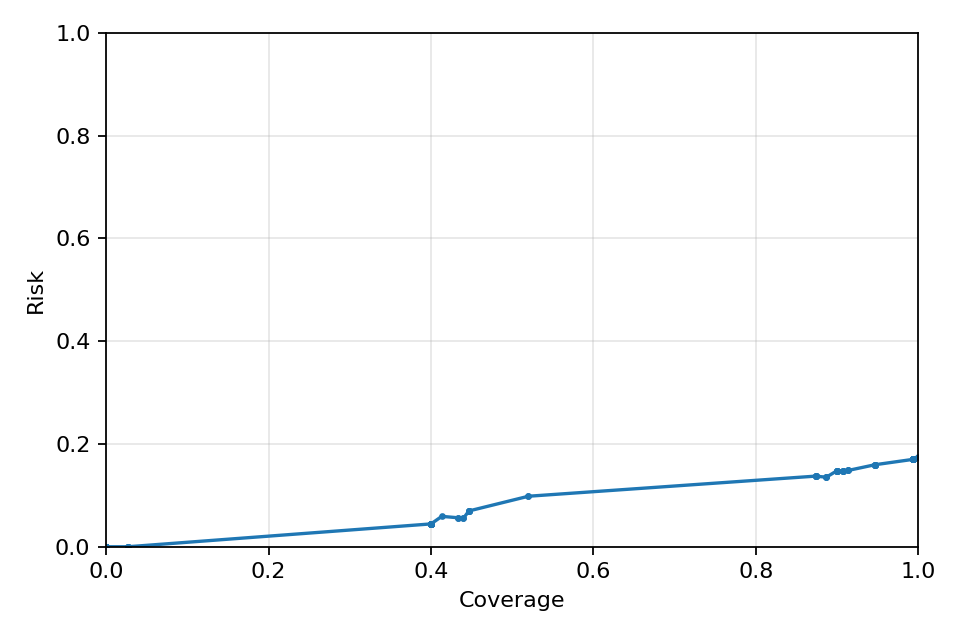

# ReliableVQA-Lite

ReliableVQA-Lite is a lightweight, reproducible research project for reliability-aware visual question answering with a real open-source VLM and real VQAv2 validation data.

It uses Qwen2.5-VL for local inference and evaluates selective prediction behavior: each example receives an answer, confidence score, and abstention decision under a global threshold `gamma`.



## Challenge Target: Reliable Visual Question Answering

This project follows the Reliable VQA / selective prediction setting.

Each prediction has answer + confidence. A global threshold gamma determines abstention: if confidence is below gamma, the system abstains.

We evaluate selective accuracy, coverage, risk, effective reliability, and accuracy-coverage / risk-coverage curves.

Exact EvalAI submission format may need final adjustment according to live challenge instructions.

This is a lightweight research/engineering demo, not a leaderboard submission attempt.

## Current Demo Results

The current checked run uses Qwen2.5-VL-3B-Instruct on real VQAv2 validation examples. These numbers are for engineering comparison, not official challenge ranking.

| Method | Split | Mean VQA | Coverage @ 0.5 | Selective Accuracy | Risk | ECE |
|---|---:|---:|---:|---:|---:|---:|
| Direct answer | val-500 | 0.8560 | 1.0000 | 0.8560 | 0.1440 | 0.1440 |
| Verbalized confidence | val-500 | 0.8160 | 0.9960 | 0.8193 | 0.1807 | 0.1229 |
| Selector over verbalized | held-out 150 | 0.8244 | 0.4467 | 0.9303 | 0.0697 | 0.2612 |

Accuracy-coverage and risk-coverage examples:

| Verbalized Confidence | Selector Confidence |
|---|---|
|  |  |
|  |  |

## Leaderboard-Style Exports

Upload-style comparison files are generated under `leaderboard_exports/`.

Standard VQA/EvalAI uses answer-only JSON:

```json
[
  {"question_id": 123, "answer": "yes"}
]
```

Current validation-subset exports:

- `leaderboard_exports/vqa_evalai/qwen3b_direct_500_val_style.json`
- `leaderboard_exports/vqa_evalai/qwen3b_verbalized_strict_500_val_style.json`
- `leaderboard_exports/vqa_evalai/selector_verbalized_500_heldout_val_style.json`

For official leaderboard upload, run the same pipeline on the official VQAv2 test-dev/test split first. The current files are format-ready comparison artifacts from validation data, not official leaderboard submissions.

## Quick Start: Real VLM + Real VQAv2 Subset

1. Activate environment:
conda activate cat-sam

2. Check environment:
python scripts/check_environment.py

3. Download VQAv2 validation data:
bash scripts/download_vqav2_val.sh

4. Prepare a 10-example subset:
python scripts/prepare_vqav2_subset.py --num_samples 10

5. Run Qwen2.5-VL-3B smoke test:
bash scripts/run_smoke_qwen3b_10.sh

6. Evaluate:
python scripts/evaluate_reliable_vqa.py \
  --pred results/qwen3b_direct_10.jsonl \
  --input data/vqav2/subsets/vqav2_val_10.jsonl \
  --out results/qwen3b_direct_10_eval.json

7. Plot:
python scripts/plot_curves.py \
  --eval results/qwen3b_direct_10_eval.json \
  --out results/plots/qwen3b_direct_10

8. Scale to 100 examples:
python scripts/prepare_vqav2_subset.py --num_samples 100
bash scripts/run_qwen3b_self_consistency_100.sh

## Installation Notes

Use the existing `cat-sam` conda environment for all GPU/model work. Check what is already installed before modifying it:

```bash
conda activate cat-sam
python scripts/check_environment.py
```

If dependencies are missing, install only the missing packages. `torch` is included in `requirements.txt` for completeness, but avoid replacing a working CUDA-enabled PyTorch build unless you intend to.

```bash
pip install -r requirements.txt
```

For the current `cat-sam` environment on this server, the validated install command was:

```bash
$CONDA_PREFIX/bin/python -m pip install 'torch<2' 'transformers==4.49.0' \
  'accelerate==0.34.2' 'qwen-vl-utils==0.0.14' jsonlines 'gradio==4.44.1' \
  --upgrade-strategy only-if-needed
```

On this server, pyenv shims may appear before the conda env on `PATH`. If `python scripts/check_environment.py` reports a Python executable outside `$CONDA_PREFIX`, run:

```bash
$CONDA_PREFIX/bin/python scripts/check_environment.py
```

Qwen2.5-VL needs a recent `transformers` build that exposes `Qwen2_5_VLForConditionalGeneration`. If the backend raises an import error, upgrade `transformers`, `accelerate`, and `qwen-vl-utils` inside `cat-sam`.

## Methods

- `direct`: image + question -> short answer, confidence fixed at `1.0`.
- `verbalized`: prompt Qwen to emit JSON with `answer` and `confidence`; raw output is saved and parsed robustly.
- `self_consistency`: sample `N` answers, majority vote normalized answers, confidence = majority frequency / `N`.
- `verifier`: ask Qwen whether a proposed answer is visually supported, then combine base and verifier confidence.
- `selector`: optional tiny logistic regression calibrator over saved confidence features. It does not fine-tune Qwen.

## Optional Selector Calibration

After real inference has produced self-consistency + verifier predictions, train a tiny held-out selector:

```bash
python scripts/train_selector.py \
  --pred results/qwen3b_self_consistency_verifier_100.jsonl \
  --input data/vqav2/subsets/vqav2_val_100.jsonl \
  --out results/selector_sc_verifier_100.pkl \
  --metrics-out results/selector_sc_verifier_100_metrics.json \
  --calibrated-out results/selector_sc_verifier_100_test.jsonl \
  --train-frac 0.7 \
  --seed 7
```

This trains only logistic regression over saved confidence features and exports held-out predictions whose `confidence` is the selector probability. Evaluate and plot those held-out predictions:

```bash
python scripts/evaluate_reliable_vqa.py \
  --pred results/selector_sc_verifier_100_test.jsonl \
  --input data/vqav2/subsets/vqav2_val_100.jsonl \
  --out results/selector_sc_verifier_100_test_eval.json

python scripts/plot_curves.py \
  --eval results/selector_sc_verifier_100_test_eval.json \
  --out results/plots/selector_sc_verifier_100_test
```

If verifier raw outputs were saved before parser improvements, reparse them without another GPU pass:

```bash
python scripts/reparse_verifier_outputs.py \
  --pred results/qwen3b_self_consistency_verifier_100.jsonl \
  --base-pred results/qwen3b_self_consistency_100.jsonl \
  --out results/qwen3b_self_consistency_verifier_100_reparsed.jsonl
```

After the 100-example pipeline is stable, scale to 500 examples:

```bash
python scripts/download_vqav2_subset_images.py --num-samples 500
python scripts/prepare_vqav2_subset.py --num_samples 500
python scripts/run_answering.py \
  --input data/vqav2/subsets/vqav2_val_500.jsonl \
  --out results/qwen3b_direct_500.jsonl \
  --method direct \
  --model Qwen/Qwen2.5-VL-3B-Instruct \
  --cache-dir data/models/huggingface \
  --torch-dtype float16 \
  --max-new-tokens 32

python scripts/run_answering.py \
  --input data/vqav2/subsets/vqav2_val_500.jsonl \
  --out results/qwen3b_verbalized_strict_500.jsonl \
  --method verbalized \
  --model Qwen/Qwen2.5-VL-3B-Instruct \
  --cache-dir data/models/huggingface \
  --torch-dtype float16 \
  --max-new-tokens 96
```

## Data

The project starts with VQAv2 validation data only:

- VQAv2 validation questions
- VQAv2 validation annotations
- COCO `val2014` images

The downloader avoids train/test by default, prints disk usage before and after, and logs to `logs/download_vqav2_val.log`.

If the full `val2014.zip` archive is too slow on a remote server, the small smoke-test image path can be populated with:

```bash
python scripts/download_vqav2_subset_images.py --num-samples 10
```

## Output Format

Inference outputs are JSONL:

```json
{
  "question_id": "123",
  "image_path": "data/vqav2/images/val2014/COCO_val2014_000000000123.jpg",
  "question": "What color is the bus?",
  "pred_answer": "yellow",
  "confidence": 0.83,
  "method": "self_consistency",
  "raw_outputs": {}
}
```

Challenge-style export:

```bash
python scripts/export_challenge_format.py \
  --pred results/qwen3b_direct_10.jsonl \
  --threshold 0.5 \
  --out results/qwen3b_direct_10_challenge.jsonl
```

## Reproducible Run Order

```bash
conda activate cat-sam
python scripts/check_environment.py
bash scripts/download_vqav2_val.sh
python scripts/prepare_vqav2_subset.py --num_samples 10
python scripts/download_qwen_weights.py --model Qwen/Qwen2.5-VL-3B-Instruct
bash scripts/run_smoke_qwen3b_10.sh
python scripts/evaluate_reliable_vqa.py --pred results/qwen3b_direct_10.jsonl --input data/vqav2/subsets/vqav2_val_10.jsonl --out results/qwen3b_direct_10_eval.json
python scripts/plot_curves.py --eval results/qwen3b_direct_10_eval.json --out results/plots/qwen3b_direct_10
python scripts/prepare_vqav2_subset.py --num_samples 100
bash scripts/run_qwen3b_self_consistency_100.sh
python scripts/evaluate_reliable_vqa.py --pred results/qwen3b_self_consistency_100.jsonl --input data/vqav2/subsets/vqav2_val_100.jsonl --out results/qwen3b_self_consistency_100_eval.json
python scripts/plot_curves.py --eval results/qwen3b_self_consistency_100_eval.json --out results/plots/qwen3b_self_consistency_100
```

## Repository Layout

```text
configs/          Model/backend configs
data/             Local VQAv2 assets and subsets
demo/             Optional Gradio demo
logs/             Download and run logs
results/          Predictions, eval JSON, plots, selector artifacts
scripts/          Reproducible command-line entrypoints
src/              Library code
tests/            Lightweight unit tests
```
